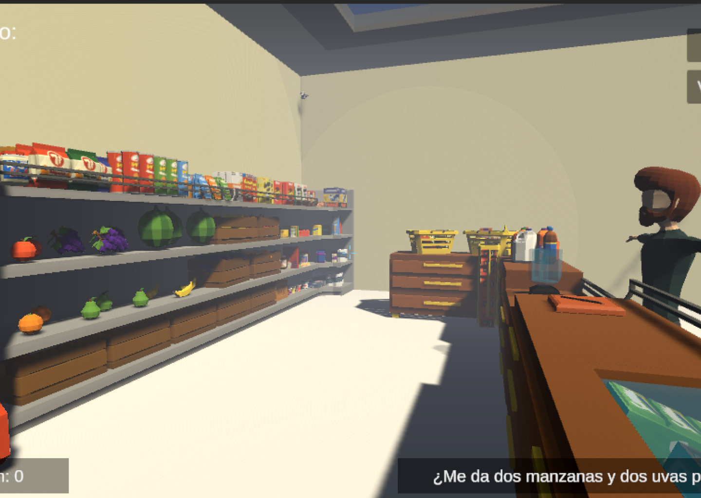
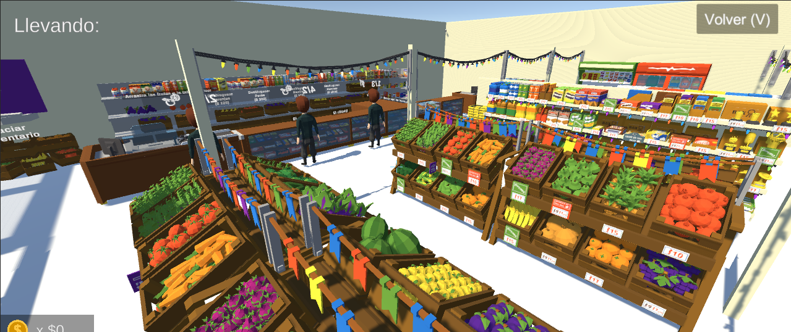
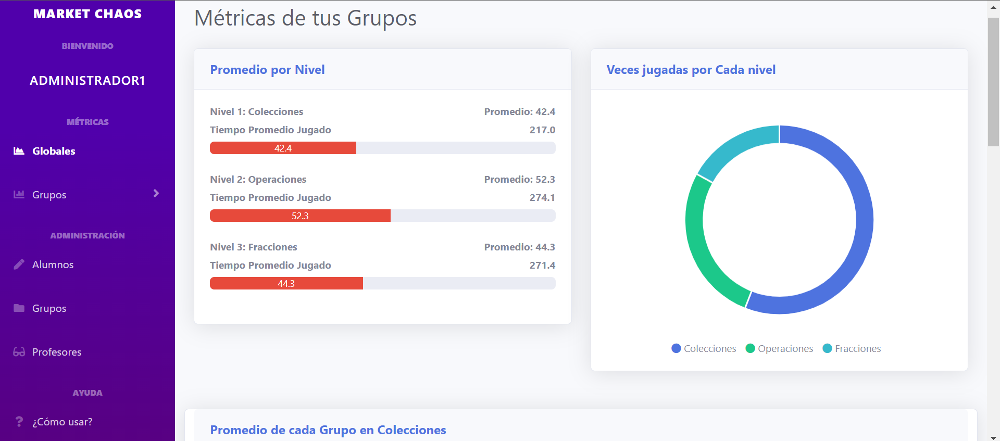
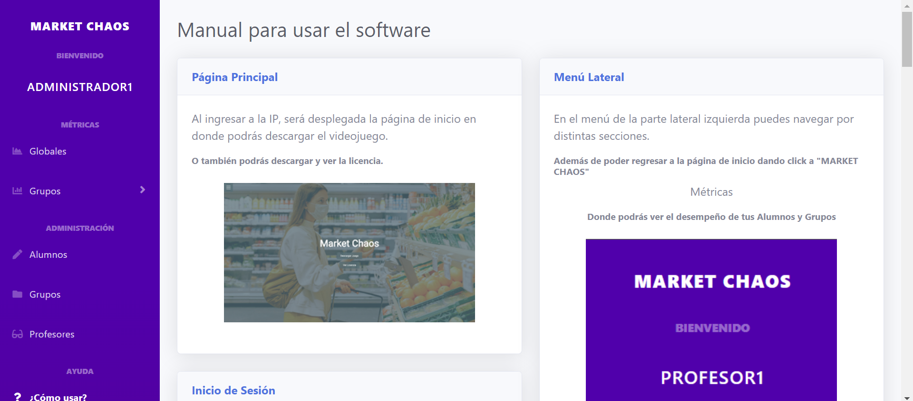
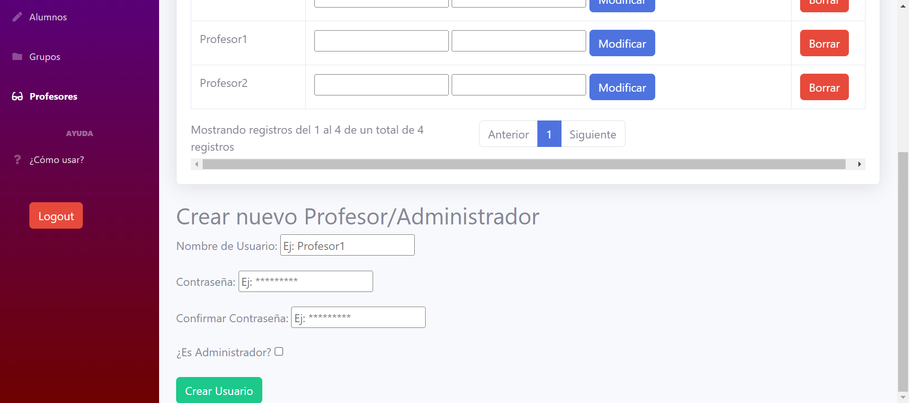
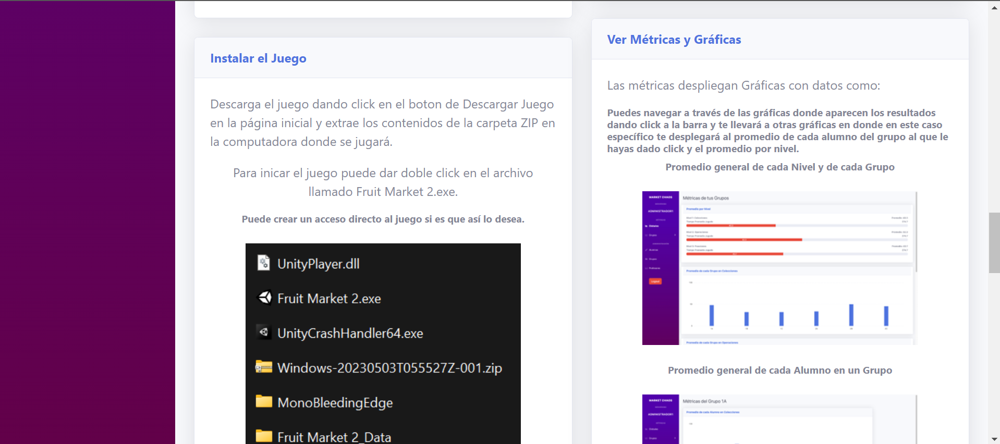
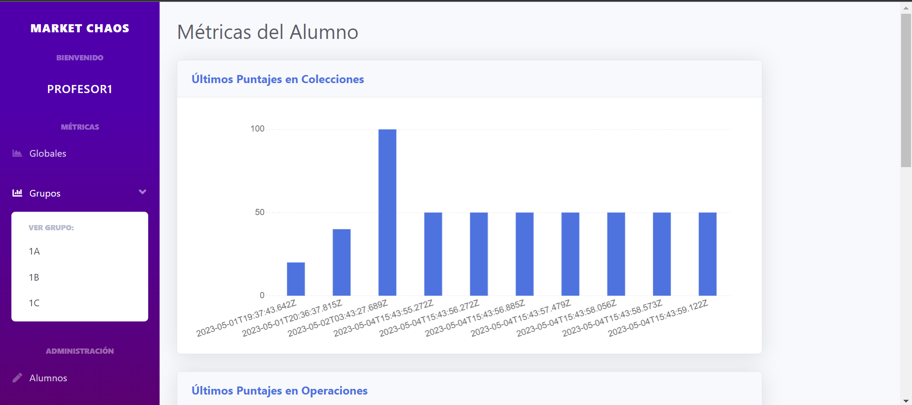

# Summary of Djmr5's Contributions

## Index
- [Summary of Djmr5's Contributions](#summary-of-djmr5s-contributions)
  - [Index](#index)
  - [Contributions](#contributions)
    - [Rental Game Website](#rental-game-website)
    - [Arithmetic Videogame & Web Dashboard](#arithmetic-videogame--web-dashboard)

## Contributions

1. ### [Rental Game Website](https://github.com/CDamianS/CiberServicio)
Website for management of multiple gaming services on a physical location, built on django.

2. ### [Arithmetic Videogame & Web Dashboard](#)
Videogame developed to enhance the arithmetic learning path for elementary school students at Mexico City.

As for the game, I developed the following features:
- [x] 3rd level game mechanics
- [x] Store design
- [x] Player crouching

| Main Functionalities  |  Tutorials |
:-------------------------:|:-------------------------:
  |  

As for the dashboard, I developed the following features:
- [x] User management
- [x] Game data visualization
- [x] Game data filtering

| Main Functionalities  |  Tutorials |
:-------------------------:|:-------------------------:
  |  
  |  
  |